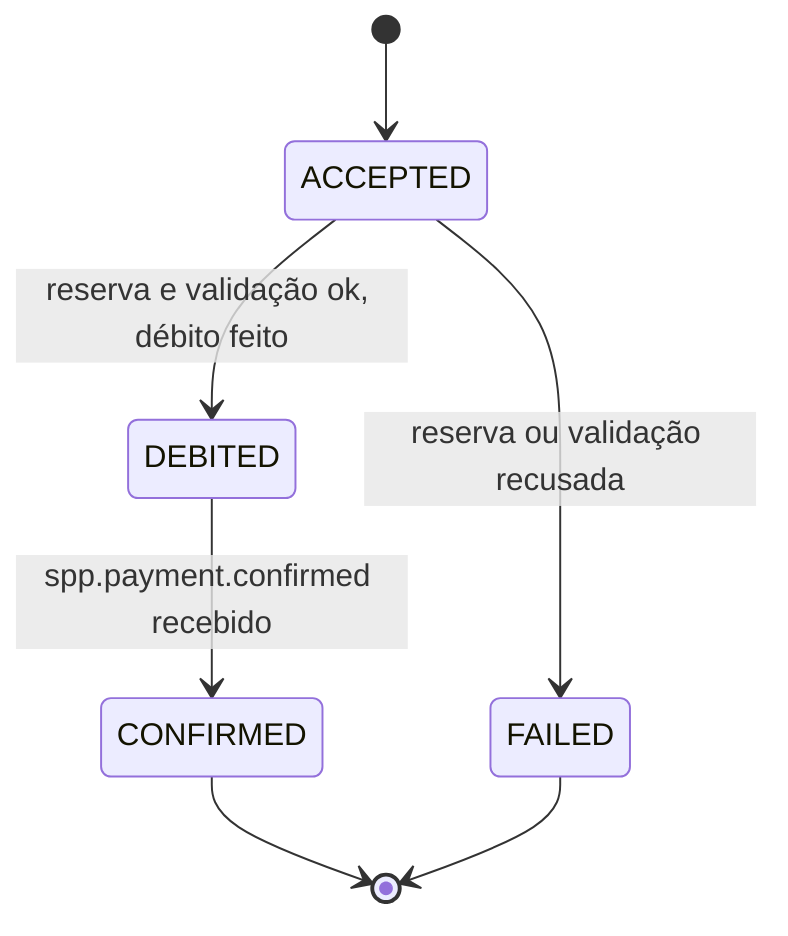

# Modelo de dados 001

Um schema por módulo no mesmo PostgreSQL. Não há FK nem consulta entre schemas; um módulo só conhece o que o outro expõe pelo contrato.

A "Conta" da spec aparece em dois lugares porque tem dois donos: a conta do cliente fica em `spp_reserve` (é lá que se reserva e debita) e a conta do merchant fica em `spp_merchant` (é lá que se credita). Nenhum módulo mexe na conta do outro.

Valores monetários são `BIGINT` (Piggies inteiros). Datas são `TIMESTAMPTZ` em UTC.

## spp_coordinator

### payment_intent

| Coluna | Tipo | Regra |
|---|---|---|
| `id` | `UUID` PK | Igual ao header `Idempotency-Key` |
| `payer_cpf` | `CHAR(11)` | Não nulo |
| `payer_agency` | `VARCHAR(4)` | Não nulo |
| `payer_account_number` | `VARCHAR(20)` | Não nulo |
| `merchant_cnpj` | `CHAR(14)` | Não nulo |
| `amount` | `BIGINT` | `> 0` |
| `stage` | `VARCHAR(16)` | `ACCEPTED`, `DEBITED`, `CONFIRMED`, `FAILED` |
| `failure_reason` | `VARCHAR(32)` | Nulo, exceto em `FAILED` |
| `version` | `BIGINT` | Lock otimista |
| `created_at` | `TIMESTAMPTZ` | |
| `updated_at` | `TIMESTAMPTZ` | Usado pelo job de reprocessamento |

Transições permitidas:

Status público: `ACCEPTED` e `DEBITED` aparecem como `PROCESSING`.

`failure_reason`: `PAYER_ACCOUNT_NOT_FOUND`, `INSUFFICIENT_BALANCE`, `MERCHANT_NOT_FOUND`, `MERCHANT_INACTIVE`.

## spp_reserve

### client

| Coluna | Tipo | Regra |
|---|---|---|
| `id` | `UUID` PK | |
| `name` | `VARCHAR(255)` | Não nulo |
| `cpf` | `CHAR(11)` | Único |

### account

| Coluna | Tipo | Regra |
|---|---|---|
| `id` | `UUID` PK | |
| `client_id` | `UUID` FK → `client` | Não nulo |
| `agency` | `VARCHAR(4)` | Único junto com `number` |
| `number` | `VARCHAR(20)` | |
| `balance` | `BIGINT` | `>= 0` |
| `reserved_balance` | `BIGINT` | `>= 0` e `<= balance` |
| `version` | `BIGINT` | |

Disponível = `balance - reserved_balance`.

### reservation

| Coluna | Tipo | Regra |
|---|---|---|
| `payment_id` | `UUID` PK | Chave de idempotência |
| `account_id` | `UUID` FK → `account` | |
| `amount` | `BIGINT` | `> 0` |
| `status` | `VARCHAR(16)` | `RESERVED`, `CONFIRMED`, `RELEASED` |
| `created_at` | `TIMESTAMPTZ` | |
| `updated_at` | `TIMESTAMPTZ` | |

Operações, cada uma numa transação:

| Operação | Efeito na conta | Transição | Repetição |
|---|---|---|---|
| Reservar | `reserved_balance += amount` (UPDATE condicional) | → `RESERVED` | Mesmos dados devolvem a existente; dados diferentes, conflito |
| Confirmar | `balance -= amount`, `reserved_balance -= amount` | `RESERVED` → `CONFIRMED` | Já `CONFIRMED` devolve sem mudar; `RELEASED` é conflito |
| Liberar | `reserved_balance -= amount` | `RESERVED` → `RELEASED` | Já `RELEASED` devolve sem mudar; `CONFIRMED` é conflito |

Confirmar e liberar leem a reserva com `SELECT ... FOR UPDATE`.

## spp_merchant

### merchant

| Coluna | Tipo | Regra |
|---|---|---|
| `id` | `UUID` PK | |
| `name` | `VARCHAR(255)` | Não nulo |
| `cnpj` | `CHAR(14)` | Único |
| `status` | `VARCHAR(16)` | `ACTIVE`, `INACTIVE` |
| `created_at` | `TIMESTAMPTZ` | |

### merchant_account

| Coluna | Tipo | Regra |
|---|---|---|
| `id` | `UUID` PK | |
| `merchant_id` | `UUID` FK → `merchant` | Único (uma conta por merchant) |
| `agency` | `VARCHAR(4)` | Único junto com `number` |
| `number` | `VARCHAR(20)` | |
| `balance` | `BIGINT` | `>= 0` |
| `version` | `BIGINT` | |

### receivable

| Coluna | Tipo | Regra |
|---|---|---|
| `payment_id` | `UUID` PK | Chave de idempotência |
| `merchant_id` | `UUID` FK → `merchant` | |
| `amount` | `BIGINT` | `> 0` |
| `status` | `VARCHAR(16)` | `CREDITED` |
| `credited_at` | `TIMESTAMPTZ` | |

Crédito, numa transação: se já existe recebível para o `payment_id`, devolve o existente. Senão, grava o recebível e soma `amount` ao saldo da `merchant_account`.

## Dados iniciais

| Módulo | Registro | Valores |
|---|---|---|
| reserve | Cliente A | CPF `12345678901`, agência `0001`, conta `000123`, saldo 500 |
| reserve | Cliente B | CPF `98765432100`, agência `0001`, conta `000456`, saldo 50 |
| merchant | Merchant X | CNPJ `12345678000199`, `ACTIVE`, agência `0001`, conta `900001`, saldo 0 |
| merchant | Merchant Y | CNPJ `98765432000155`, `INACTIVE`, agência `0001`, conta `900002`, saldo 0 |

Os seeds usam CPF e CNPJ como chave natural e não duplicam ao reiniciar.
