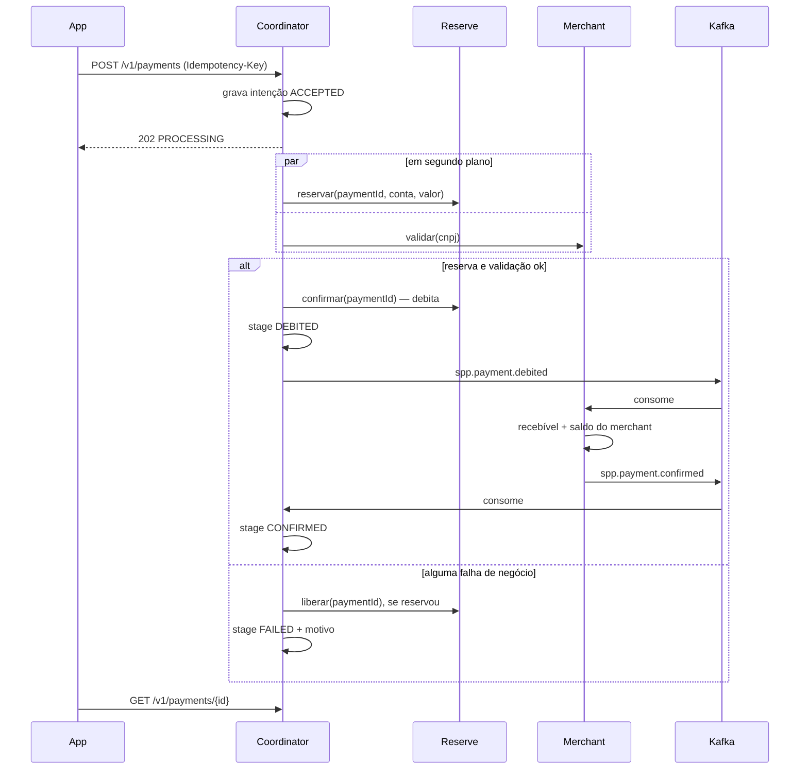

# Plano 001 — Pagamento com Piggies via QR Code

- **Spec:** [spec.md](spec.md)
- **Modelo de dados:** [data-model.md](data-model.md)
- **Contratos:** [contracts/](contracts/)
- **Estado:** aprovado em 24/09/2026, com D11 no plano B (DTOs à mão)

## Resumo

Um processo Micronaut com três módulos isolados: `coordinator`, `reserve` e `merchant`. O coordinator é a única borda pública: grava a intenção, responde `202` e orquestra o resto em segundo plano. Reserva e validação rodam em paralelo por chamadas locais atrás de portas. O débito é síncrono. O crédito ao merchant e o fechamento do pagamento passam por Kafka, como pede o enunciado.

## Contexto técnico

| Item | Escolha |
|---|---|
| Linguagem | Java 25 |
| Framework | Micronaut 5.1.5 (Netty, Serde Jackson, Validation, Problem JSON) |
| Persistência | PostgreSQL 16, Micronaut Data + Hibernate JPA |
| Mensageria | Kafka (Micronaut Kafka) |
| Contratos | OpenAPI 3.0.3 por serviço, JSON Schema (draft 2020-12) por evento |
| Testes | JUnit 5, AssertJ, Awaitility, Testcontainers (Postgres e Kafka) |
| A adicionar | ArchUnit e `com.networknt:json-schema-validator` (teste) |

## Checagem da constituição

| Princípio | Como o plano cumpre |
|---|---|
| I. Contract-first | Três OpenAPI e dois JSON Schema em `contracts/`, escritos antes do código. Controllers e DTOs escritos à mão espelhando os contratos (D11). Eventos validados contra o schema em teste. |
| II. Borda assíncrona | `POST /v1/payments` grava e responde `202` com `Location`. O processamento roda depois do commit, em outra thread. |
| III. Monólito modular | Um schema por módulo, sem FK entre schemas. Só o pacote `facade` de um módulo pode ser importado por outro, e só pelos adaptadores `coordinator.infra.local`. Regra verificada por ArchUnit. |
| IV. Idempotência | Chave primária de intenção, reserva e recebível é o `paymentId`. Toda operação repetida devolve o resultado existente. |
| V. Testes | Tabela "Estratégia de testes" liga cada cenário da spec a um teste. |
| VI. Incremental | Cinco fatias; a partir da S1, cada uma deixa o sistema demonstrável. |
| VII. Rastreabilidade de IA | Prompts em `docs/ai/`. |

Nenhuma exceção à constituição.

## Arquitetura

```text
co.inter.piggies
├── coordinator
│   ├── web          PaymentsController e DTOs do contrato
│   ├── domain       PaymentIntent, Stage, FailureReason, PaymentService,
│   │                portas PaymentIntentStore, ReserveGateway, MerchantGateway
│   ├── orchestration PaymentOrchestrator (reserva ∥ validação → débito → evento)
│   └── infra
│       ├── persistence  PaymentIntentRepository (Micronaut Data, schema spp_coordinator) atrás de PaymentIntentStore
│       ├── messaging    producer spp.payment.debited, listener spp.payment.confirmed
│       └── local        LocalReserveGateway, LocalMerchantGateway (únicos que importam outro módulo)
├── reserve
│   ├── facade       ReserveFacade + records de entrada e saída (API pública do módulo)
│   ├── web          ReservationsController, AccountsController
│   ├── domain       regras de reserva, débito e liberação
│   └── infra        repositórios JPA (schema spp_reserve), seed
└── merchant
    ├── facade       MerchantFacade + records (API pública do módulo)
    ├── web          MerchantsController, ReceivablesController
    ├── domain       validação e crédito
    └── infra        repositórios JPA (schema spp_merchant), consumer/producer Kafka, seed
```

Regras de dependência (teste ArchUnit):

- `reserve` e `merchant` não dependem de nenhum outro módulo.
- `coordinator.domain` e `coordinator.orchestration` dependem só das próprias portas.
- Só `coordinator.infra.local` importa `reserve.facade` e `merchant.facade`.
- Nenhum módulo importa `domain`, `infra` ou `web` de outro.

Para extrair um módulo depois, troca-se o adaptador `Local*Gateway` por um cliente HTTP gerado do mesmo contrato. As regras de negócio não mudam.

## Fluxo



## Decisões

**D1. Um datasource, um schema por módulo.**
Cada entidade declara `@Table(schema = ...)`. O Hibernate cria os schemas (`create_namespaces`) e as tabelas nesta versão. Alternativa descartada por agora: um datasource e um Flyway por módulo, que isola melhor mas custa configuração de transação por qualificador. Vira melhoria quando o primeiro módulo for extraído.

**D2. Chamadas entre módulos: locais, atrás de portas.**
O coordinator define `ReserveGateway` e `MerchantGateway` no próprio domínio. Os adaptadores locais chamam as fachadas. Chamar HTTP para `localhost` agora só adicionaria latência e falhas sem ganho. Os controllers HTTP de reserve e merchant existem para cumprir o contrato e serão o alvo do adaptador HTTP na extração.

**D3. Reserva identificada pelo `paymentId`.**
`PUT /v1/reservations/{paymentId}` cria de forma idempotente. Confirmar e liberar usam o mesmo id. O coordinator não precisa guardar um `reservationId`.

**D4. Reserva sem corrida.**
Um `UPDATE` condicional faz a checagem e a reserva ao mesmo tempo: `reserved_balance = reserved_balance + :amount WHERE balance - reserved_balance >= :amount`. Zero linhas afetadas significa saldo insuficiente. Duas reservas simultâneas nunca passam do disponível. Constraints `CHECK` no banco são a última defesa.

**D5. Validação do merchant é uma consulta.**
`GET /v1/merchants/{cnpj}`. O coordinator traduz 404 em `MERCHANT_NOT_FOUND` e `INACTIVE` em `MERCHANT_INACTIVE`.

**D6. Crédito por evento.**
Depois do débito, o coordinator publica `spp.payment.debited`. O merchant consome, credita numa transação (recebível + saldo), publica `spp.payment.confirmed` e só então confirma o offset. Se a publicação falhar, o Kafka reentrega; o crédito repetido é ignorado pela chave do recebível e o evento é republicado. O coordinator fecha a intenção ao consumir `spp.payment.confirmed`, que também serve a outros sistemas (US3). O crédito não volta a checar se o merchant está ativo: o cliente já foi debitado e o dinheiro precisa chegar.

**D7. Estágio interno além do status público.**
A intenção guarda `stage`: `ACCEPTED`, `DEBITED`, `CONFIRMED`, `FAILED`. A API mostra `ACCEPTED` e `DEBITED` como `PROCESSING` (decisão 5 da spec). `DEBITED` nunca vai para `FAILED`.

**D8. Processamento em segundo plano.**
O controller chama `PaymentService.accept` (transação própria). Se a intenção é nova, dispara o orquestrador no executor de tarefas bloqueantes (virtual threads) depois do commit. Reserva e validação rodam como dois `CompletableFuture` e o orquestrador junta os resultados.

**D9. Reprocessamento de intenções presas.**
Falha técnica (exceção, timeout, Kafka fora) deixa a intenção em `ACCEPTED` ou `DEBITED`. Um job agendado retoma intenções paradas há mais de 30 segundos: `ACCEPTED` refaz o fluxo (tudo idempotente) e `DEBITED` republica o evento. Entra na fatia S4.

**D10. Idempotency-Key é o id da intenção.**
O app gera um UUID e o envia no header. Mesmo UUID e mesmos dados devolvem `202` com o estado atual. Dados diferentes devolvem `409`.

**D11. DTOs escritos à mão; geração a partir do OpenAPI adiada.**
Os contratos em `contracts/` continuam sendo a fonte de verdade. Controllers e DTOs (records Java) são escritos à mão com os mesmos nomes de campo, tipos e validações do contrato. Os testes de integração HTTP verificam status, campos e códigos de erro de cada operação usada. A geração de código (`openapi-generator-maven-plugin`) e um teste automático de conformidade com o contrato ficam para depois da S4, para não gastar a S0 depurando o gerador com Micronaut 5.

**D12. Erros em `application/problem+json` com extensão `code`.**
`code` carrega o motivo de negócio (`INSUFFICIENT_BALANCE`, `IDEMPOTENCY_CONFLICT` etc.) para o cliente não depender do texto.

**D13. Dados iniciais por módulo.**
Cada módulo tem um seed idempotente na inicialização: Cliente A (500 Piggies), Cliente B (50 Piggies), Merchant X (ativo) e Merchant Y (inativo). Valores em [data-model.md](data-model.md).

## Tratamento de falhas

| Situação | Resultado |
|---|---|
| Amount não inteiro ou ≤ 0, campo fora do formato | `400`, nada gravado |
| Mesma Idempotency-Key com outros dados | `409 IDEMPOTENCY_CONFLICT` |
| Conta do pagador não existe ou não é do CPF | `FAILED` / `PAYER_ACCOUNT_NOT_FOUND` |
| Saldo insuficiente | `FAILED` / `INSUFFICIENT_BALANCE` |
| Merchant inexistente | `FAILED` / `MERCHANT_NOT_FOUND`, reserva liberada |
| Merchant inativo | `FAILED` / `MERCHANT_INACTIVE`, reserva liberada |
| Reserva e merchant falham juntos | `FAILED` com o motivo da reserva (nada a liberar) |
| Falha técnica antes do débito | Continua `ACCEPTED`; o job da S4 retoma |
| Falha ao publicar depois do débito | Continua `DEBITED`; o job da S4 republica |
| Falha do merchant ao creditar ou publicar | Offset não confirmado; Kafka reentrega |

## Estratégia de testes

| Cenário da spec | Tipo | Onde |
|---|---|---|
| US1.1, US1.4 — resposta imediata `PROCESSING` | Integração HTTP com gateways lentos | coordinator |
| US1.2, US1.3 — A paga 100 a X | Ponta a ponta (Postgres + Kafka) | jornada |
| US2.1 — saldo insuficiente | Unitário (regra) + integração (reserve) + ponta a ponta | reserve, jornada |
| US2.2, US2.3 — merchant inativo / inexistente | Unitário (orquestrador) + ponta a ponta | coordinator, jornada |
| US2.4 — conta do pagador inválida | Integração | reserve |
| US2.5 — amount inválido | Integração HTTP | coordinator |
| US3.1, US3.2 — evento publicado só no sucesso | Ponta a ponta + validação contra JSON Schema | jornada |
| US4.1, US4.2 — reenvio da chave | Integração HTTP | coordinator |
| US4.3 — etapa repetida | Integração (reserva, débito e crédito chamados duas vezes; evento duplicado) | reserve, merchant |
| Borda: reservas simultâneas | Integração com threads concorrentes | reserve |
| Regra de módulos | ArchUnit | todos |

Unitários não sobem container. Integrações herdam de uma base com Postgres e Kafka compartilhados entre as classes de teste.

## Fatias de entrega

As tarefas de cada fatia estão em [tasks.md](tasks.md).

| Fatia | Entrega | Histórias |
|---|---|---|
| **S0 — Fundação** | Pacotes dos módulos, entidades e seeds, teste ArchUnit, base de testes com containers | — |
| **S1 — Jornada HTTP** | `POST`/`GET` de pagamento, orquestração paralela, reserva, validação, débito e liberação. Crédito chamado direto pela fachada do merchant, para a jornada fechar sem Kafka | US1, US2 |
| **S2 — Eventos** | `spp.payment.debited` e `spp.payment.confirmed` com schema; o crédito direto da S1 sai e passa a ser pelo consumer do merchant | US3 |
| **S3 — Idempotência e concorrência** | `409` de chave, evento duplicado, etapas repetidas, reservas simultâneas | US4, casos de borda |
| **S4 — Resiliência e APIs internas** | Job de reprocessamento; controllers HTTP de reserve e merchant conforme contrato | FR-012, SC-003 |

Se o tempo acabar, a ordem de corte é de baixo para cima: S4, depois S3. S0 a S2 cobrem o enunciado.

## Riscos

| Risco | Mitigação |
|---|---|
| DTO escrito à mão divergir do contrato | Testes HTTP conferem campos e códigos; geração e teste de conformidade depois da S4 (D11) |
| Testes de Kafka instáveis por tempo | Awaitility com timeout explícito; um consumer group por classe de teste |
| `hbm2ddl` não cria `CHECK` como esperado | `@Check` do Hibernate nas entidades; o `UPDATE` condicional já impede saldo negativo |
| Crash entre gravar a intenção e disparar o orquestrador | Job de reprocessamento (S4) |
